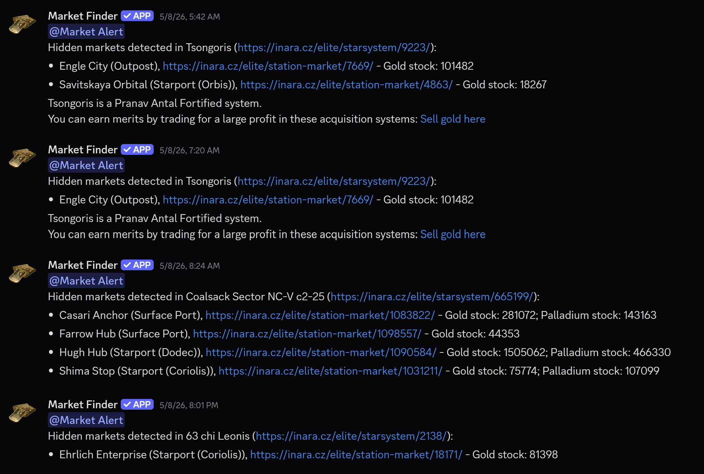

# 🔍 Gold Detector Discord Bot

**Find hidden markets selling Gold, Palladium & Silver at 90% off before anyone else knows they exist**

> **Note:** If you invited the bot before January 1, 2026, you need to manually grant it **View Channels** permission. See [Troubleshooting](#troubleshooting) for details.

## Quick Start

### For Users (DM Alerts)

1. Add the bot using the invite link above — select **"Add to My Apps"**
2. In any server with the bot, or in a DM, type `/alerts_on`
3. Done — you'll receive DM alerts when hidden markets are found
4. To stop, type `/alerts_off`

### For Servers

1. Add the bot using the invite link above — select a server (requires **Manage Server** permission)
2. The bot will post alerts in `#market-watch` and ping `@Market Alert` by default
3. *(Optional)* Set a custom channel: `/set_alert_channel #your-channel`
4. *(Optional)* Set a custom role: `/set_alert_role @your-role`
5. Run `/diagnose` to verify the bot has the right permissions

> **Required bot permissions:** View Channels, Send Messages

## How It Works

The Infrastructure Failure BGS state slashes Gold, Palladium, and Silver prices by 90%, allowing 60k+ credits of profit/ton. 

But there's a catch. Once a station's discounted price shows up on **Inara**, the station stock gets drained within hours, and the deal is gone within hours.

**Here's the edge:** the bubble is so large that Inara doesn't update every station in real time. This bot detects the stations that *are* in infrastructure failure but whose market data Inara *hasn't caught up on yet*. Their price is still 90% off, their stock is untouched, and nobody else knows about them. That's where the real money is.

In addition, you can use this cheap gold to earn merits by selling it in an acquisition system. The bot will append merit-earning PowerPlay information to market messages when such opportunities are available in the same system. You can choose which PowerPlay factions to receive this appended information for using preferences. See [Preferences](#preferences) and [Commands](#commands).

> Note: You may read about other effects of BGS on markets [here](https://cdb.sotl.org.uk/effects)

## Features
- **🔥 90% Off Markets** — When a station hits infrastructure failure, its prices plummet 90%. The bot finds the stations Inara *hasn't* updated yet — so the deal is still live and fully stocked.
- **Hidden Market Detection** — Catches stations in infrastructure failure whose market data hasn't synced to Inara (price >28,000 CR). Gold and Palladium need over 15,000 tons in stock to trigger an alert; Silver needs over 50,000 tons.
- **Gold, Palladium & Silver** — Monitors all three commodities
- **PowerPlay Integration** — Alerts for Fortified and Stronghold systems with merit-earning opportunities
- **DM & Server Alerts** — Get alerts via direct message, server channel, or both
- **Customizable Filters** — Filter by station type, commodity, or PowerPlay faction
- **Per-Server Configuration** — Custom channels, roles, ping control, and opt-out
- **Opportunity Lifecycle** — Alerts fire once per recipient while a hidden market remains active, then can fire again if the opportunity expires and later reappears.

## Preferences

Want to filter your alerts? Use `/set_preferences` to choose station types, commodities, or PowerPlay leaders to include. Without setting preferences, you receive all alerts by default.

| Category | Options | Example |
|----------|---------|---------|
| Station Type | Starport, Outpost, Surface Port | `/set_preferences station_type Starport, Outpost` |
| Commodity | Gold, Palladium, Silver | `/set_preferences commodity Gold` |
| PowerPlay | *(Any faction leader)* | `/set_preferences powerplay Zachary Hudson` |

> Preferences can be set per-user or per-server. Add `target: server` to set server-wide defaults (requires Manage Server permission). Without `target`, preferences apply to your personal alerts. PowerPlay preferences filter which appended PowerPlay information appears in alerts, not whether commodity alerts are sent.

## Commands

### User Commands

These commands work in any server with the bot, or in DMs. No special permissions needed.

| Command | Description |
|---------|-------------|
| `/alerts_on` | Subscribe to DM alerts |
| `/alerts_off` | Unsubscribe from DM alerts |
| `/ping` | Check if the bot is online |
| `/help` | Get a link to this page |

### Server Commands

**Configuration commands** — require **Manage Server** permission:

| Command | Description |
|---------|-------------|
| `/set_alert_channel` | Set a custom alert channel |
| `/clear_alert_channel` | Revert to default (`#market-watch`) |
| `/set_alert_role` | Set a custom role to ping |
| `/clear_alert_role` | Revert to default (`@Market Alert`) |
| `/server_alerts_on` | Enable server alerts *(default: enabled)* |
| `/server_alerts_off` | Disable server alerts |
| `/server_ping_on` | Enable `@role` pings with alerts |
| `/server_ping_off` | Disable `@role` pings (alerts still sent) |

**Info commands** — work in any server, no special permission needed:

| Command | Description |
|---------|-------------|
| `/show_alert_settings` | Display current server configuration |
| `/diagnose` | Check bot permissions in the current channel |

> Both info commands are server-only (they don't work in DMs) but any member can run them.

### Preference Commands

Filter which alerts you receive, or which PowerPlay merit information is appended. Add `target: server` for server-wide defaults (requires Manage Server).

| Command | Description |
|---------|-------------|
| `/set_preferences station_type` | Filter by station type (Starport, Outpost, Surface Port) |
| `/set_preferences commodity` | Filter by commodity (Gold, Palladium, Silver) |
| `/set_preferences powerplay` | Filter PowerPlay information appended to market alerts |
| `/set_preferences show` | Display your current preferences |
| `/set_preferences remove` | Remove specific options from a category |
| `/set_preferences clear` | Clear one category or all preferences |

> **Tip:** Values are comma-separated. Example: `/set_preferences station_type Starport, Outpost`

## Usage

After setting up the bot, simply wait for pings. Successful gold detections will occur sometimes a few times a week, sometimes once a month. Repeated alerts are suppressed while the same opportunity remains active, meaning each recipient receives exactly one alert per active opportunity. If the opportunity expires and later reappears, a new alert will be sent. Sometimes, some fields of the message will be "unknown". These stations are still worth visiting because sometimes Inara does not get full market data due to colonization.

Once you get a message, just go to the station in your hauling ship (and your carrier if you have one) and then start buying the commodity. You can use Inara commodity search to find good sell prices nearby. Or you can load your carrier to the top and then find good sell prices later. You can make hundreds of millions of credits by doing this, and this is definitely the best trading you can find outside of much rarer special conditions.

**Note:** when you get to the station, you will see the stock is 10% of what the bot reports. The stock will actually refill over time until all of the stock it originally had is gone so do not worry.

## FAQ

**Q: Why do some alert fields show "unknown"?**
A: Some stations don't have complete market data on Inara, often due to colonization. These stations are still worth visiting.

**Q: I set up the bot but I'm not getting alerts. What's wrong?**
A: Hidden market opportunities aren't always available. Alerts can come a few times a week or once a month depending on BGS state. Make sure you've run `/alerts_on` (for DMs) or that your server is configured with `/set_alert_channel`. Run `/diagnose` to check permissions.

**Q: Can I get alerts for Gold, Palladium, and Silver?**
A: Yes, you receive all three by default. Use `/set_preferences commodity` to filter if you prefer.

**Q: What's the difference between user and server preferences?**
A: User preferences filter your personal DM alerts and your view of server alerts. Server preferences (set with `target: server`) apply as a default filter for everyone in that server.

## Troubleshooting

**Bot doesn't respond to commands**
- Make sure the bot has **View Channels** permission in the channel you're using
- If you invited the bot before January 1, 2026, the original invite link had incorrect permissions. Go to **Server Settings → Integrations → Gold Detector** and manually grant **View Channels**

**Bot isn't posting alerts in my server**
- The bot posts to `#market-watch` by default — make sure this channel exists, or set a custom one with `/set_alert_channel`
- Run `/diagnose` in your alert channel to check permissions
- Verify the bot has: **View Channels**, **Send Messages**, and **Embed Links** in the alert channel
- Check that server alerts are enabled: `/show_alert_settings`

**I'm not receiving DM alerts**
- Confirm you've run `/alerts_on`
- Check your Discord privacy settings: **Settings → Privacy & Safety → Allow direct messages from server members**
- If your DMs are closed, the bot will automatically unsubscribe you after a failed delivery

**"View Channels" permission fix (pre-January 2026 invites)**
- Bot invite permissions were corrected on January 1, 2026
- If you invited the bot before this date, it may be missing the **View Channels** permission
- Fix: Go to **Server Settings → Integrations → Gold Detector → Manage** and enable **View Channels**
- Alternatively, kick and re-invite the bot using the current invite link

## Reporting Bugs

Found a bug or have a suggestion? [Open an issue on GitHub](https://github.com/congenial-acorn/gold-detector/issues).

## Contributing

Contributions are welcome! Feel free to open a pull request or submit an issue. This project is licensed under the MIT License.

## Legal

The source code is now under the MIT license since v1.5.0 (previously under CC0).

Neither the bot nor the developer is associated with Frontier Developments, Elite Dangerous, Inara.cz, or any other member or tool of the Elite Dangerous community.

- [Terms of Service](./TERMS_OF_SERVICE.md)
- [Privacy Policy](./PRIVACY_POLICY.md)

